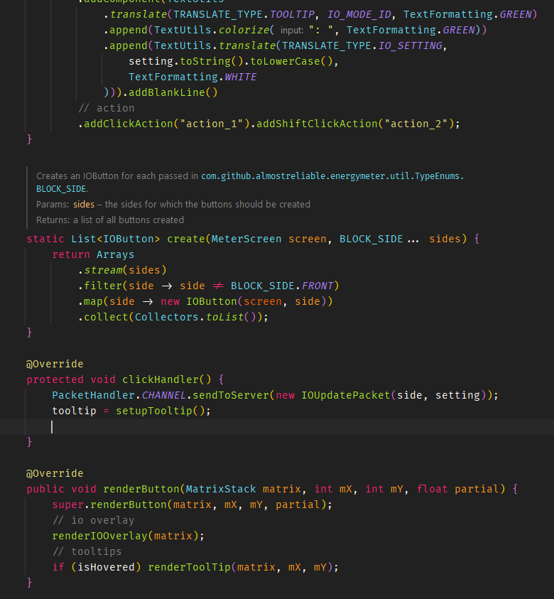

<h1 align="center">
    
Relentless Colors

</h1>

A vibrant color scheme for all [JetBrains] IDEs. 
Check it out on the [Marketplace].

## **📑 Overview**

This is a color scheme for all [JetBrains] IDEs. It features vibrant and contrasting colors to give you the
best possible coding experience. The carefully chosen colors harmonise perfectly with a dark theme.

Here is a preview: 

## **🔨 Prerequisites**

**Relentless-Colors** is only a color scheme. Therefore it is recommended to install an IDE theme before.
Keep in mind that **Relentless-Colors** is recommended to be used with a dark theme.

My personal recommendation is the *JetBrains Islands Dark* theme. If you want to try a different theme,
make sure to adjust the background colors of the color scheme accordingly.

## **🔧 Installation**

Installation from [Marketplace] (*recommended*):

1. Start your preferred [JetBrains] IDE and go to plugins.
2. Search for **Relentless-Colors** and install it.
3. Restart your IDE.
4. Go to the settings and navigate to *Editor > Color Scheme*.
5. Select **Relentless-Colors**.
6. Hit **Apply** and **OK**.

Manual installation:

1. Download the latest **jar-file** from the [releases].
2. Start your preferred [JetBrains] IDE and go to the settings.
3. Navigate to *Editor > Color Scheme*.
4. Click the three dots at the top and hit **Import Scheme...**.
5. Navigate to the downloaded *Relentless-Colors.jar* and hit **OK**.
6. Hit **Apply** and **OK**. An IDE restart may be required.

## **🎓 License**

This project is licensed under [The Unlicense].

<!-- Links -->
[JetBrains]: https://www.jetbrains.com/
[Marketplace]: https://plugins.jetbrains.com/plugin/14347-relentless-colors-color-scheme
[color themes]: https://plugins.jetbrains.com/search?tags=Theme
[theme]: https://plugins.jetbrains.com/plugin/12255-visual-studio-code-dark-plus-theme
[JetBrains Mono]: https://github.com/JetBrains/JetBrainsMono
[releases]: https://github.com/rlnt/idea-relentless-colors/releases
[changelog]: CHANGELOG.md
[The Unlicense]: LICENSE
